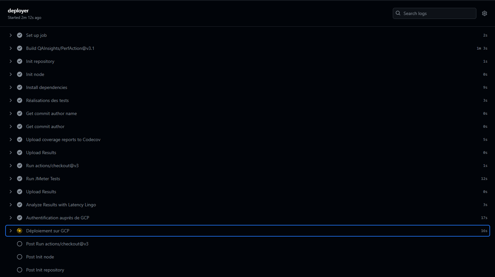

# Documentation pour le déploiement d'une application GitHub sur Google Cloud Platform (GCP)

Cette documentation fournit un guide étape par étape pour le déploiement d'une application développée en suivant les principes du Test-Driven Development (TDD) et hébergée sur GitHub, sur Google Cloud Platform (GCP) en utilisant Cloud Functions et une intégration continue via GitHub Actions.

 

#### 1. Création de l'application avec des fonctions et des tests

Objectif : développer une application en utilisant TDD, en écrivant des tests avant le code fonctionnel pour chaque fonctionnalité.

- Développer en TDD : commencer par écrire des tests pour chaque nouvelle fonctionnalité avant de coder la fonctionnalité elle-même.
- Écrire des tests : créer des tests unitaires pour chaque fonction pour garantir leur bon fonctionnement. Les noms des fonctions de test unitaire doivent suivre le pattern : `test[nomMethode][cas][resultat/comportementAttendu]()`, assurant une régularité entre toutes les fonctions.
- Ajouter des tests fonctionnels : créer des tests fonctionnels pour valider le comportement de l'application dans son ensemble.
- Exécuter les tests : s'assurer que tous les tests passent localement avant de procéder à la mise en ligne de l'application.

 
 

#### 2. Création d'un compte GCP

Objectif : configurer un compte sur Google Cloud Platform pour héberger l'application.

- Inscription sur GCP : visiter [Google Cloud Platform](https://cloud.google.com/) et suivre les instructions pour créer un nouveau compte.
- Configuration de facturation : entrer les informations de facturation nécessaires pour activer les capacités de déploiement de l'application.

 
 

#### 3. Ajout de collaborateurs dans IAM

Objectif : configurer l'accès pour les membres de l'équipe via Identity and Access Management (IAM).

- Accéder à IAM : aller à la console IAM de GCP et sélectionner le projet concerné.
- Ajouter des membres : utiliser l'option « Ajouter des membres » pour inviter des collaborateurs et leur attribuer des rôles appropriés (par exemple, éditeur ou visualiseur).

 
 

#### 4. Installation du CLI et création d'un compte de service

Objectif : installer Google Cloud SDK et configurer un compte de service pour l'automatisation.

- Installer Google Cloud SDK : télécharger et installer le CLI de Google Cloud depuis la page officielle.
- Initialiser le SDK : lancer `gcloud init` pour configurer l'accès au projet GCP.
- Créer un compte de service : utiliser `gcloud iam service-accounts create` pour créer un nouveau compte de service.

 
 

#### 5. Modification des rôles

Objectif : assurer que le compte de service a les permissions nécessaires pour déployer et gérer les fonctions.

- Configurer les rôles : attribuer les rôles de « Fonctions Admin » et « Token Creator » au compte de service via la console IAM.

 
 

#### 6. Extraction du JSON pour le secret

Objectif : générer une clé pour le compte de service et l'exporter sous forme de fichier JSON.

- Générer la clé : utiliser `gcloud iam service-accounts keys create` pour créer une clé.
- Sauvegarder le fichier JSON : stocker le fichier JSON en sécurité, car il contient les informations d'authentification pour le compte de service.

 
 

#### 7. Modification de l'application pour ajouter un serveur web

Objectif : intégrer un serveur web à l'application en utilisant Express.js.

- Installer Express : ajouter Express à l'application via NPM ou Yarn.
- Configurer le serveur : écrire le code nécessaire pour démarrer un serveur web et exposer les fonctionnalités de l'application à travers des routes HTTP.

 
 

#### 8. Premier déploiement sur GCP Functions

Objectif : déployer l'application sur GCP pour la première fois.

- Préparer le déploiement : s'assurer que le code est prêt et testé.
- Utiliser GCP CLI : déployer l'application en utilisant `gcloud functions deploy`.

 
 

#### 9. Création de la pipeline GitHub pour les déploiements automatiques

Objectif : automatiser le déploiement de l'application à chaque commit sur GitHub.

- Configurer GitHub Actions : créer un fichier de workflow dans `.github/workflows` avec les étapes nécessaires pour construire, tester et déployer l'application.
- Utiliser les secrets de GitHub : stocker les secrets nécessaires, comme les clés GCP, dans les secrets de GitHub pour les utiliser dans les workflows.
- Déclencher le workflow : configurer le workflow pour qu'il se déclenche à chaque push ou pull request sur les branches spécifiées.

 
 

#### 10. Intégration avec Codecov pour le reporting du coverage

Objectif : suivre et améliorer la couverture des tests de l'application.

- Lier le repository à Codecov : configurer Codecov dans le repository GitHub pour obtenir des rapports sur la couverture des tests.
- Ajouter le badge Codecov : inclure un badge dans le README pour afficher la couverture des tests en temps réel.

 
 

#### 11. Création de tests de stress avec JMeter

Objectif : évaluer la performance de l'application sous charge.

- Installer JMeter : télécharger et installer Apache JMeter.
- Créer des tests de stress : configurer des plans de test dans JMeter pour simuler des charges importantes sur l'application.
- Exécuter et analyser : exécuter les tests de stress et analyser les résultats pour identifier les points de défaillance et optimiser les performances de l'application.

Cette documentation vous aidera à déployer efficacement une application développée en TDD sur GCP à l'aide de GitHub. Adapter les étapes spécifiques aux détails de votre projet pour une meilleure intégration.